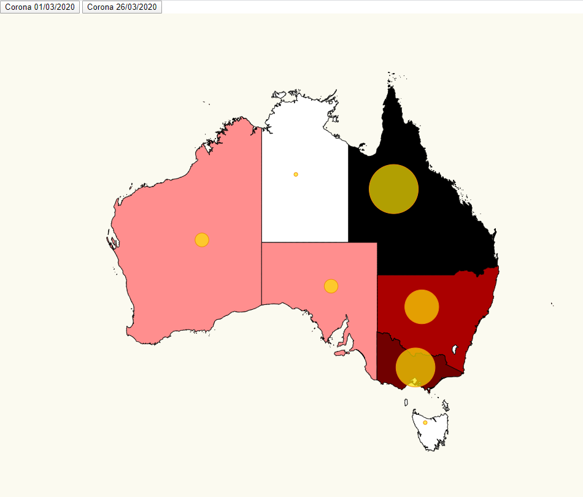

# Máster Advanced Analytics on Big Data (2019-2021)
# Universidad de Málaga

# Typescript Exercise 

This was a challange exercise in my masters. It visualizes a map of Australia with different colours for each region depending of the number of infected and stats of COVID-19 afected in 2 separate dates.



I accomplished tasks here:

- Placed pins on a map based on location.
- Scaled pins radius based on affected number.
- Australia is represented in d3 a little bit different in comparison to spain BE CAREFUL.
- With each stats the map changes colour depending of the number of infected.
- Floating tooltip with data over each circle.
- The jardest part was to match topojson files with our stats (AU states were numbers instead of names so I had to locate them manually).

# Install

- Execute _npm install_. It will install everything in order to work.

```bash
npm install
```

# Start

- Start the script _npm start_. It will start the project and you can see the result in your browseron: http://localhost:1234/.

```bash
npm start
```

# Code Annotations

- My code is fully commented through the execution, almost line by line. For more detail you should look in specific libraryes.

